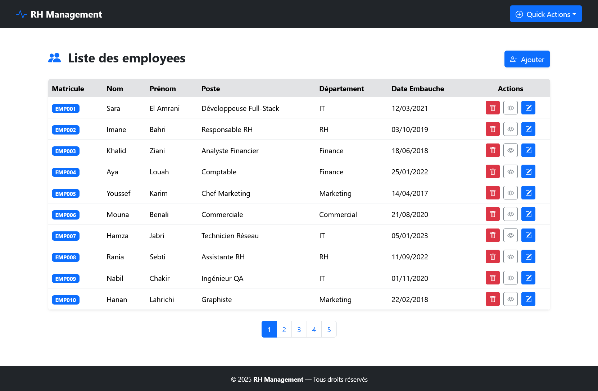
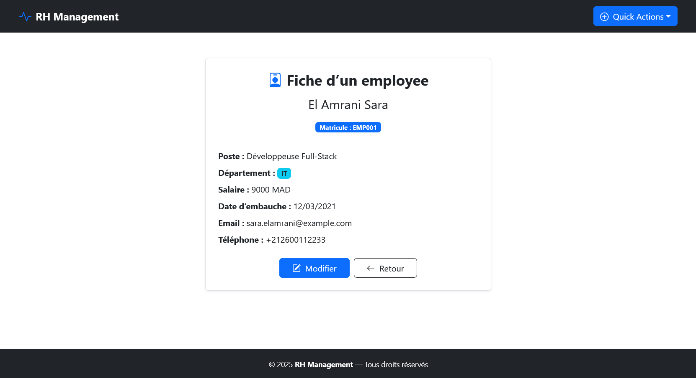
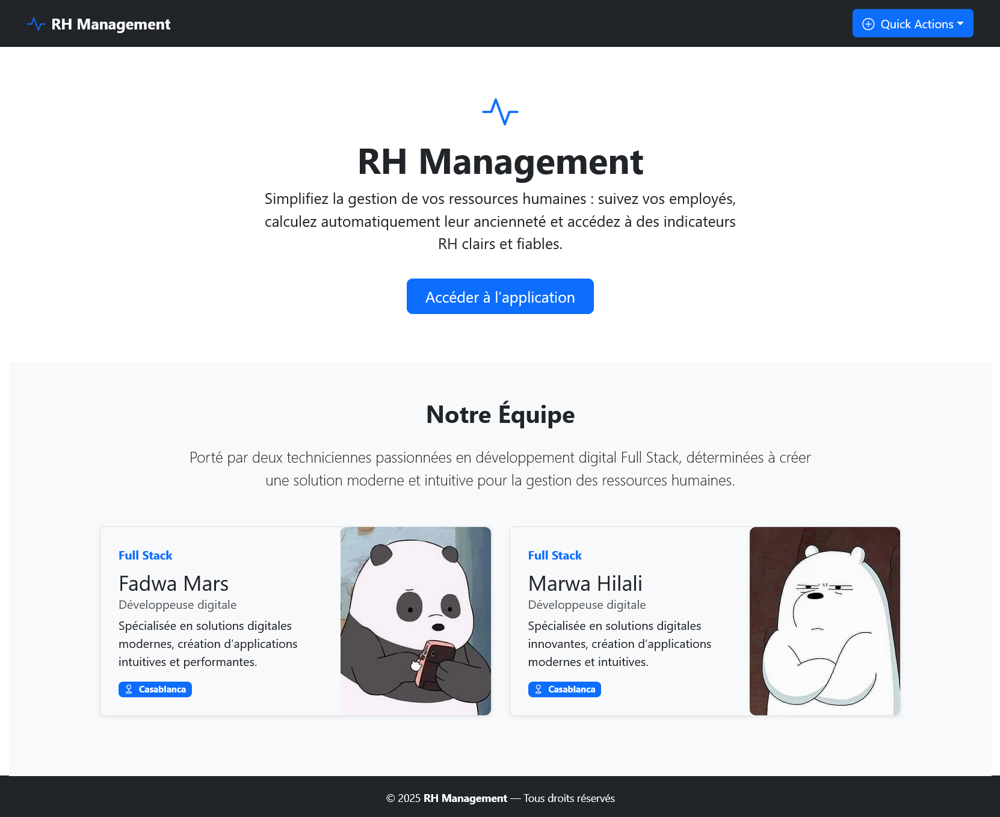
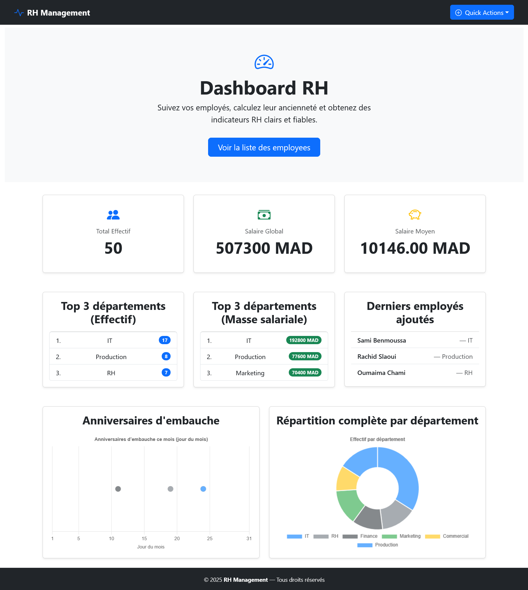
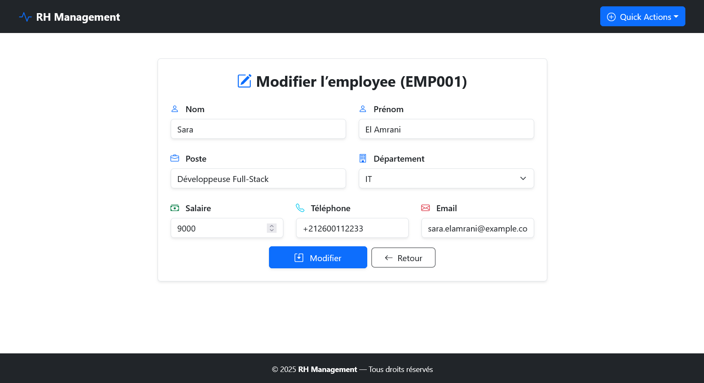
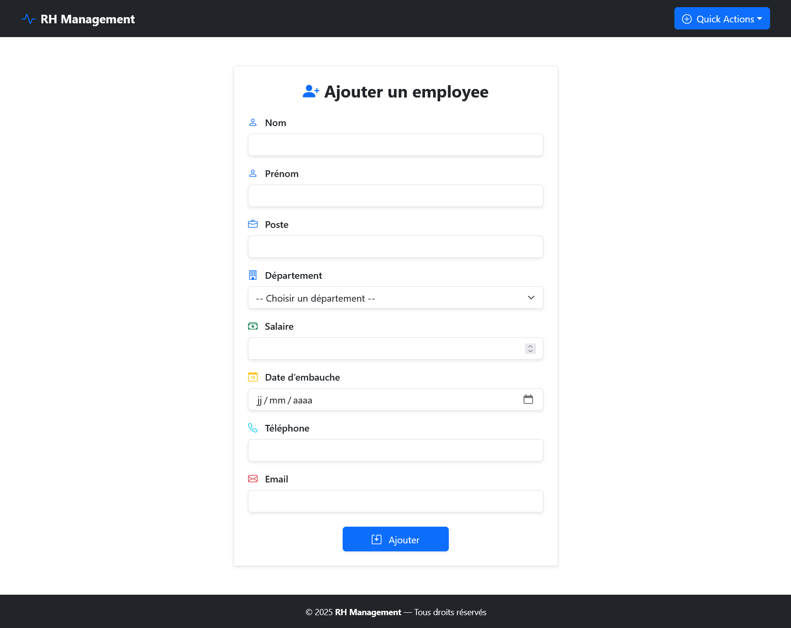

# 👩‍💼 Application RH — Gestion des Employés
## 📚 Projet Académique Full-Stack (React.js + Redux & API REST)


## 🧾 Présentation générale

Ce projet est une **application web de gestion des ressources humaines**, réalisée dans un **cadre académique**, visant à appliquer les concepts du **développement Full-Stack**.

L’application permet de gérer les **employés** et les **départements** d’une entreprise fictive appelée **InnovateTech**, en s’appuyant sur :
- un **Frontend** développé avec **React.js et Redux**
- un **Backend** sous forme d’**API REST** développée avec **Node.js & Express.js**


## 🎯 Objectifs pédagogiques

- Mettre en œuvre l’architecture **Client / Serveur**
- Utiliser **Redux** pour la gestion globale de l’état
- Concevoir et consommer une **API REST**
- Implémenter les opérations **CRUD**
- Structurer un projet Frontend et Backend
- Déployer une API sur une plateforme cloud (**Vercel**)


## 🖼️ Aperçu de l’application

### Liste des employés 


### Detail d'un employee


### LandingPage


### Dashboard 


### Modifier employee


### Ajout d'un employee



# 🎨 FRONTEND — Application RH (React.js + Redux)

## 📌 Rôle du Frontend

Le frontend constitue l’**interface utilisateur** de l’application.  
Il permet à l’utilisateur RH d’interagir avec le système via une interface dynamique et ergonomique.

La **gestion de l’état global** de l’application (employés, départements, opérations CRUD) est assurée par **Redux**.


## 🚀 Fonctionnalités Frontend

### 👥 Gestion des employés
- ➕ Ajouter un employé
- 📋 Afficher la liste des employés
- 🔍 Consulter le détail d’un employé
- ✏️ Modifier un employé
- 🗑️ Supprimer un employé par matricule

### 📊 Tableau de bord RH
- Génération automatique du **matricule**
- Calcul automatique de l’**ancienneté**
- Graphiques de répartition par département
- Affichage des anniversaires d’embauche


## 🔄 Gestion de l’état avec Redux

Redux est utilisé pour :
- Centraliser les données
- Éviter le *prop drilling*
- Synchroniser l’état entre les composants
- Faciliter la maintenance et l’évolution de l’application


## ⚙️ Installation du Frontend

```bash
npx create-react-app gestion-employees
cd gestion-employees
npm install react-router-dom axios redux react-redux
npm install react-chartjs-2 chart.js
npm start
```

📍 **Application accessible sur :**  
http://localhost:3000


## 🛠️ Technologies Frontend

-   
  **[React.js](https://react.dev/)** : bibliothèque JavaScript pour la création d’interfaces utilisateur dynamiques et réactives.

-   
  **[Redux](https://redux.js.org/)** : gestion centralisée et prévisible de l’état global de l’application.

-   
  **[React Router DOM](https://reactrouter.com/)** : gestion de la navigation et du routage entre les différentes pages de l’application.

-   
  **[Axios](https://axios-http.com/)** : bibliothèque HTTP pour communiquer avec l’API backend (GET, POST, PUT, DELETE).

-   
  **[Chart.js](https://www.chartjs.org/)** : création de graphiques interactifs pour la visualisation des données RH.

-   
  **[Bootstrap](https://getbootstrap.com/)** : framework CSS pour une mise en page responsive et des composants UI modernes.

-   
  **CSS3** : stylisation personnalisée et animations.


---

# 🔧 BACKEND — EmployeRhManagement API

## 📌 Rôle du Backend

Le backend assure la **gestion des données**, la **logique métier** et l’exposition des **endpoints REST** consommés par le frontend **React.js + Redux**.


## 🛠️ Technologies Backend

-   
  **[Node.js](https://nodejs.org/)** : environnement d’exécution JavaScript côté serveur.

-   
  **[Express.js](https://expressjs.com/)** : framework minimaliste pour la création d’API REST.

-   
  **JSON** : stockage des données (choix pédagogique).

-   
  **[Vercel](https://vercel.com/)** : déploiement et hébergement de l’API backend.


## 🔍 Fonctionnalités Backend

- CRUD complet pour les employés  
- CRUD complet pour les départements  
- Génération automatique du matricule  
- Calcul de l’ancienneté  
- Gestion des erreurs et validations  

## 🔗 Endpoints de l’API

### 👥 Employés

| Méthode | Endpoint | Description |
|--------|---------|------------|
| GET | `/employees` | Récupérer tous les employés |
| GET | `/employees/:matricule` | Récupérer un employé |
| POST | `/employees` | Ajouter un employé |
| PUT | `/employees/:matricule` | Mettre à jour un employé |
| DELETE | `/employees/:matricule` | Supprimer un employé |


### 🏢 Départements

| Méthode | Endpoint | Description |
|--------|---------|------------|
| GET | `/departments` | Récupérer tous les départements |
| GET | `/departments/:id` | Récupérer un département |
| POST | `/departments` | Ajouter un département |
| PUT | `/departments/:id` | Mettre à jour un département |
| DELETE | `/departments/:id` | Supprimer un département |

## ☁️ Déploiement

- Backend déployé sur **Vercel**
- API consommée par le frontend **React.js + Redux**


## 🎓 Compétences acquises

- Développement React.js avec Redux  
- Architecture Client / Serveur  
- Création d’API REST  
- Gestion de l’état global  
- Communication Frontend / Backend  
- Déploiement cloud  

